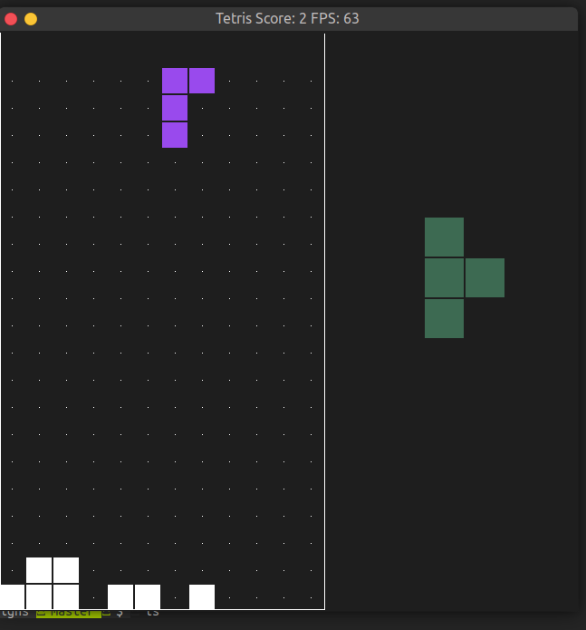

# CPPND: Capstone Project: Tetris Game

This is a Repo for the Capstone project in the [Udacity C++ Nanodegree Program](https://www.udacity.com/course/c-plus-plus-nanodegree--nd213). I have chosen TetrisGame as my final project.

## Dependencies for Running Locally
* cmake >= 3.7
  * All OSes: [click here for installation instructions](https://cmake.org/install/)
* make >= 4.1 (Linux, Mac), 3.81 (Windows)
  * Linux: make is installed by default on most Linux distros
  * Mac: [install Xcode command line tools to get make](https://developer.apple.com/xcode/features/)
  * Windows: [Click here for installation instructions](http://gnuwin32.sourceforge.net/packages/make.htm)
* SDL2 >= 2.0
  * All installation instructions can be found [here](https://wiki.libsdl.org/Installation)
  >Note that for Linux, an `apt` or `apt-get` installation is preferred to building from source. 
* gcc/g++ >= 5.4
  * Linux: gcc / g++ is installed by default on most Linux distros
  * Mac: same deal as make - [install Xcode command line tools](https://developer.apple.com/xcode/features/)
  * Windows: recommend using [MinGW](http://www.mingw.org/)

## Basic Build Instructions

1. Clone this repo.
2. Make a build directory in the top level directory: `mkdir build && cd build`
3. Compile: `cmake .. && make`
4. Run it: `./TetrisGame`.

## Playing instructions
1. Use Navigation buttons to Play
2. Next shape to come is displayed on the right side.
3. Button usages
   * UP button - change orientation of the shapes/Tetromino
   * DOWN button - move faster
   * LEFT button - move the shape to left side
   * RIGHT button - move the shape to right side

## Rubris points and Criteria:
1. Loops, I/Os & Functions:
   * Code is structured into functions and loops to perform various tasks.
   * I/Os is used to read user inpur as Key strokes and process it.
3. OOPS:
   * Code strucutures into Classes and Functions.
   * Uses proper access specifier for classes to handle encapsulation.
   * Classes - `Tetro, Board, Game and Controller`
   * Uses Initializer list for specific members.
   * Encapsulates behavious with class methods.
   * Polymorphism - `IsCollision` function in Game class for different requirements
3. Memory management:
   * Usage of Smart pointers in `Game` class
   * Unique pointer is used in `Game` class for `Tetro` instances to own
   * Use of references in `Tetro class` methods
   * Rule of 5 is implemented in `Tetro class`
4. Concurrency:
   * Not used in the project.
